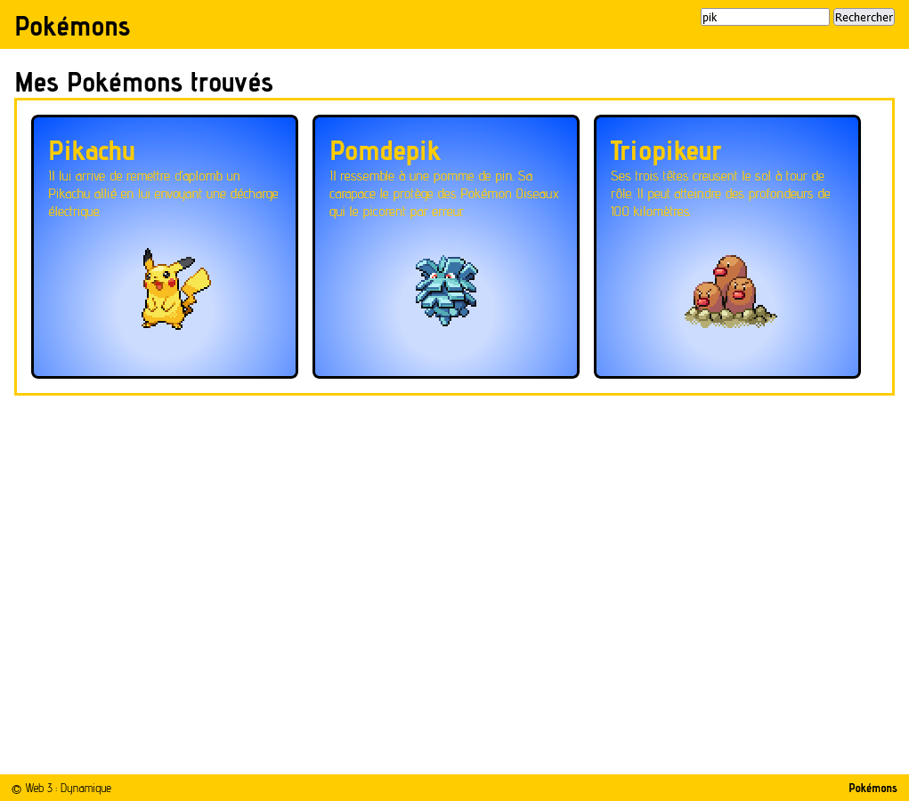
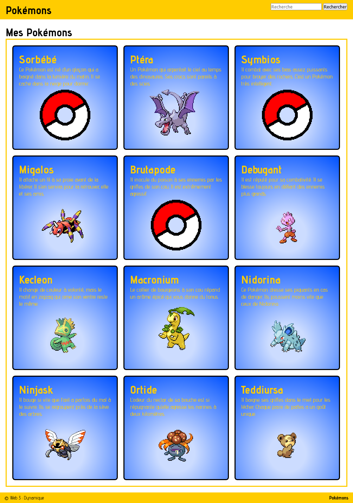

<!-- Utiliser `Ouvrir l'aperçu` pour une lecture optimale (CTRL-SHIFT-V) -->

<!-- 
  ______ ____  _____  __  __       _______ _____ ______ 
 |  ____/ __ \|  __ \|  \/  |   /\|__   __|_   _|  ____|
 | |__ | |  | | |__) | \  / |  /  \  | |    | | | |__   
 |  __|| |  | |  _  /| |\/| | / /\ \ | |    | | |  __|  
 | |   | |__| | | \ \| |  | |/ ____ \| |   _| |_| |     
 |_|    \____/|_|  \_\_|  |_/_/    \_\_|  |_____|_|     
                                                        
-->

# Pokémons
Reproduisez l'application montrée dans la démo du professeur.

## Sommaire
| [Fonctionnement](#fonctionnement)
| [Le rite de passage](#le-rite-de-passage)
| [Les fonctions](#les-fonctions)
| [La recherche](#la-recherche)
| [L'API](#lapi)
| [Le SCSS](#le-scss)
| [Les tâches](#les-tâches)
| [Les saisies d'écran](#les-saisies-décran)
| [Remise](#remise)
|

## Fonctionnement
Lorsque l'usager arrive dans le site, des Pokémons aléatoires sont affichés dans la page. Par la suite, l'usager peut faire une recherche à l'aide du formulaire prévu à cet effet. L'affichage est alors remplacé par les Pokémons satisfaisant le critère de recherche.

## Le rite de passage
Les fichiers `resultatAlea.html` et `resultatRecherche.html` présentent une version HTML de la page terminée. Servez-vous-en pour reproduire avec des commandes Javascript le HTML de base de l'application. Gardez à l'esprit que le code doit être placé dans des fonctions spécifiques (voir ci-dessous).

## Les fonctions
Pour l'épreuve vous devez créer les 5 fonctions suivantes :
- `html_listePokemons`
- `html_pokemon`
- `html_nom`
- `html_description`
- `html_image`

**Note**: Si vous avez de la difficulté avec les fonctions, vous pouvez sauver les meubles en complétant l'épreuve complètement dans la fonction `main`

## La recherche
Le formulaire de recherche est déjà dans la page `index.html`. Vous n'avez pas à faire quoi que ce soit avec celui-ci à part vous en servir dans votre Javascript.

## L'API
Les données doivent provenir de l'adresse suivante :
- https://mboudrea.tim-cstj.ca/epreuve3/pokemon.php
- https://mboudrea.tim-cstj.ca/epreuve3/pokemon.php?mot=pikachu _(à modifier en fonction de la recherche demandée)_

Vous pouvez vous référer aux fichiers `_assets/exempleAlea.json` et `_assets/exempleRecherche.json` pour la structure du document retourné par l'API. Vous __ne devez pas__ utiliser ces fichiers dans la version remise.

## Le SCSS
L'imbrication d'une partie du fichier `css/style.scss` a été omise. Vous devez refaire l'imbrication des règles qui se trouvent à la fin du fichier.

## Les tâches
1. Ajouter la fonction responsable de l'acquisition des données provenant de l'API;
1. Utiliser cette fonction pour récupérer les données aléatoires (voir les commentaires dans le `main`);
1. Programmer les fonctions demandées (rite de passage) avec ou sans les données réelles;
1. Ajouter les données réelles si ce n'est pas déjà fait;
1. Ajouter et compléter l'événement du formulaire (voir les commentaires dans le `main`);
1. Arranger le SCSS comme décrit plus haut;

## Les saisies d'écran

## Remise
- Travail individuel
- À faire en classe
- Durée : 3h
- Compte dans l'évaluation synthèse de cours
- Compte pour 15% de la note finale
- Renommer le dossier NOMP0123456 AVANT de le zipper et de le remettre sur https://remise.cstj.qc.ca (epreuve_synthese)

---
### Provenance du contenu textuel
Les donnees proviennent du site https://pokeapi.co/